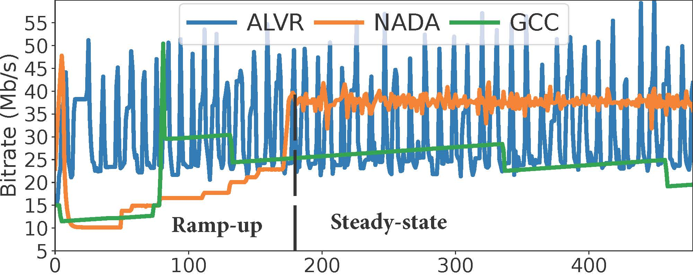
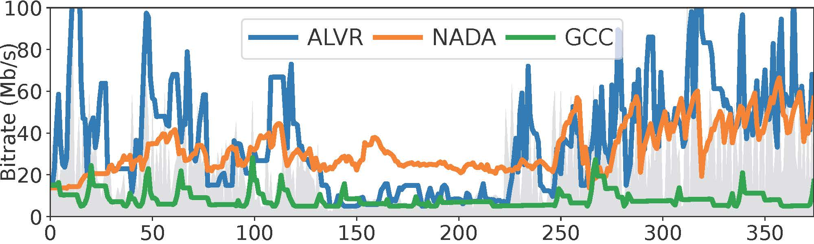
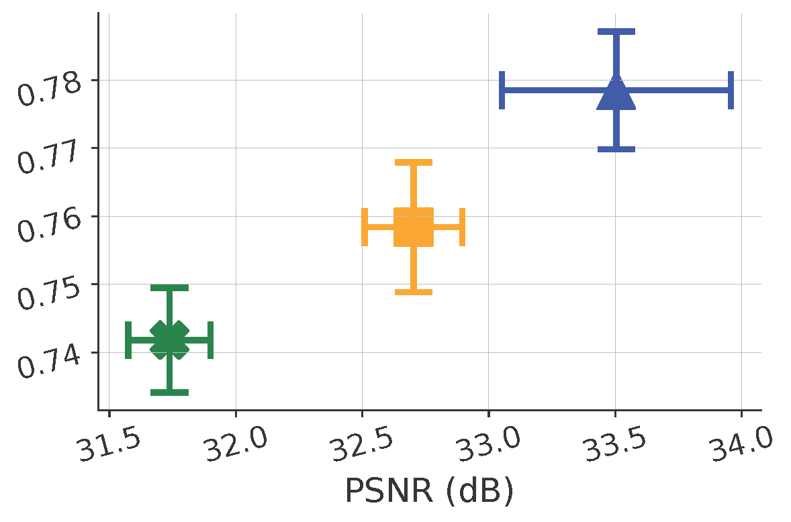
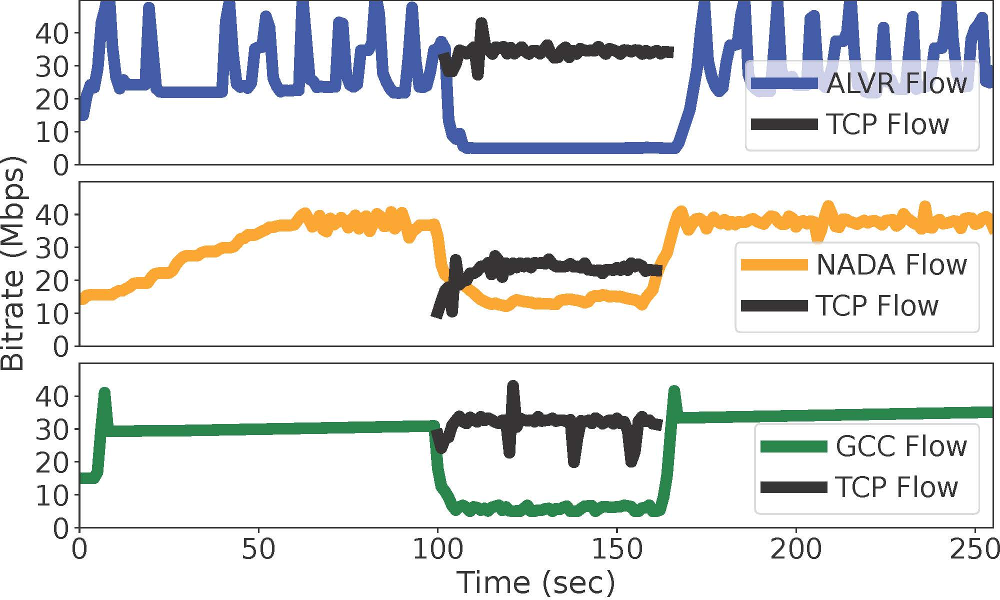

[Congestion Control for VR Cloud Gaming: Integration and Comparison in Real VR Gaming Environment](https://dl.acm.org/doi/abs/10.1145/3746027.3755439)    
To be published in the Proceedings of the 33rd ACM International Conference on Multimedia 2025 (ACM MM'25)   
The system is built upon the [codebase of ALVR](https://github.com/alvr-org/ALVR).  
We are grateful to the ALVR team for their work, and we acknowledge and give them credit for their contributions. 
ALVR streams VR games from your PC to your VR headset via Wi-Fi.  
Please read more details about the supported VR Headsets, PC OS, requirements, and tools required on [ALVR](https://github.com/alvr-org/ALVR).

## Build from source
We created 3 main branches: 1) the default branch (GCC) implements the Google Congestion Control algorithm based on its [RFC](https://datatracker.ietf.org/doc/html/draft-ietf-rmcat-gcc-02) and the [webrtc opensource](https://webrtc.googlesource.com/src/) , 2) the NADA branch implements the Cisco standard (NADA: A Unified Congestion Control Scheme for Real-Time Media) according to its [RFC](https://datatracker.ietf.org/doc/draft-ietf-rmcat-nada/02/), and 3) ALVR-origin implements the default ALVR bitrate control. Note that you need to change the ALVR bitrate to adaptive (ABR) before testing on ALVR-origin.

Once cloned, you can checkout any branch and follow the guide [here](https://github.com/alvr-org/ALVR/wiki/Building-From-Source) to build the server and client applications from source.

## System Architecture

We integrated GCC and NADA for adaptive game streaming and evaluated them against ALVR adaptive bitrate (ABR mode). This integration not only enables fair performance evaluation across benchmarks but also ensures game-agnostic VR cloud gaming through interoperation with SteamVR. 

The **Network Statistics** module feeds network performance metrics to the **Congestion Control** module to compute the target bitrate according to the network conditions. This module outputs the target bitrate and passes it to the **Video Encoder** module.
## System Performance 
### Bitrate to network throughput
|  |  |
|-------------------------------------------------------------------------|----------------------------------------------------------------------------------------------------------------|
| *Stable WiFi Network* | *5G Mobile Network* |

For Stable Bandwidth (35Mb/s), NADA and GCC operate in two phases:  Ramp-up and Steady-state phase. ALVR-ABR displays a highly oscillatory pattern in bitrate changes.

For 5G Network Bandwidth, ALVR-ABR frequently overshoots in its attempts to utilize the available bandwidth. NADA maintains a relatively lower target bitrate and experiences fewer overshooting events during high bandwidth variation. GCC has the fewest overshooting events. 

### Motion-to-photon Latency 
|  |  |
|------------------------------------------------------------------------------------|------------------------------------------------------------------------|
| *Stable WiFi Network* | *5G Mobile Network* |

For Stable Bandwidth (35Mb/s), NADA and GCC maintain low and stable latency during the Ramp-up stage. While GCC exhibits low latency in its Steady-state phase, NADA faces significantly higher latency and fluctuating latency. ALVR-ABR shows the highest latency and pronounced oscillation. GCC presents the lowest latency of an average of 63 ms, with the lowest network latency of 7 ms, while NADA presents a higher latency of an average of 94 ms, with a significantly higher network latency of 40 ms. ALVR-ABR exhibits the highest latency of an average of 127 ms, with the highest network latency of 74 ms. 

For 5G Network Bandwidth, ALVR-ABR exhibits high latency (mean 126 ms) with significant variations. Congestion resulting from NADA's regular overshooting when bandwidth variation is low results in prolonged latency spikes, with an average of 112 ms. GCC shows the lowest latency (mean 73 ms) with minimal spikes. This is reflected in GCC's lowest network latency (mean 17 ms), while NADA has a notably higher latency (mean 61 ms). ALVR-ABR displays the highest network latency (mean 76 ms). Notably, GCC's lower bitrate results in more delivered frames awaiting decoding, which leads to longer queuing delays in the buffer and, consequently, a higher DecQ compared to benchmarks.

### Visual Quality (PSNR and SSIM)
|  |  |
|--------------------------------------------------------------------------------------------------------------------------|------------------------------------------------------------------------------------------------------------------------|
| *Stable WiFi Network* | *5G Mobile Network* |

GCC has lowest image quality in both SSIM and PSNR, over both network setups. ALVR-ABR achieves the highest SSIM and PSNR over mobile networks, while it is slightly lower than that of NADA under a stable bandwidth setup. NADA tends to assign the highest bitrate under stable networks, making NADA exhibit a slightly higher SSIM and PSNR, compared to ALVR-ABR.

### Protocol Fairness

NADA receives a higher, yet lower than half, bandwidth share. Since ALVR-ABR is not loss-based, and GCC is delay-based, their bandwidth share drops significantly. Only NADA maintains a fairly equitable bandwidth share.
