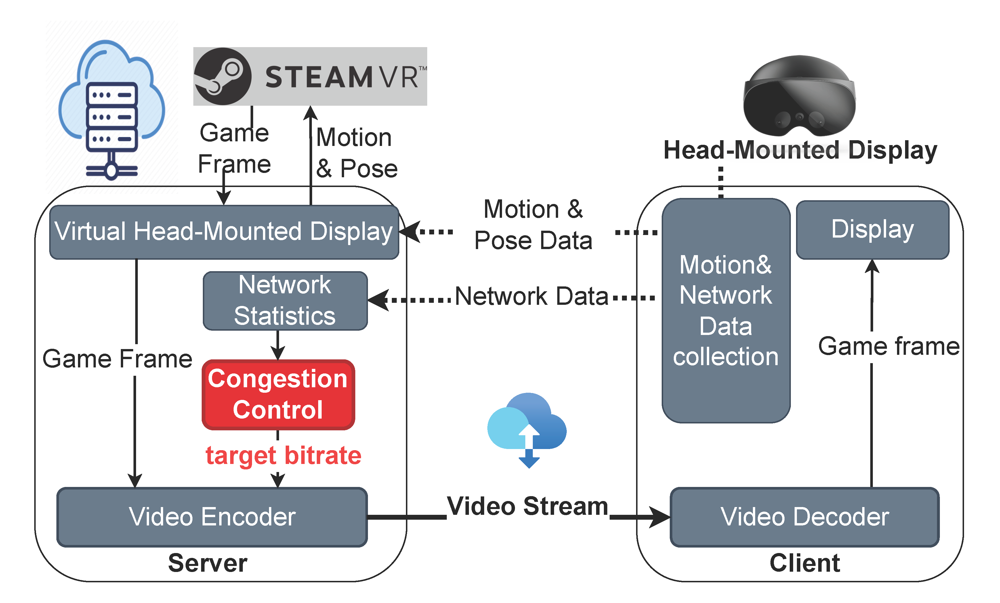
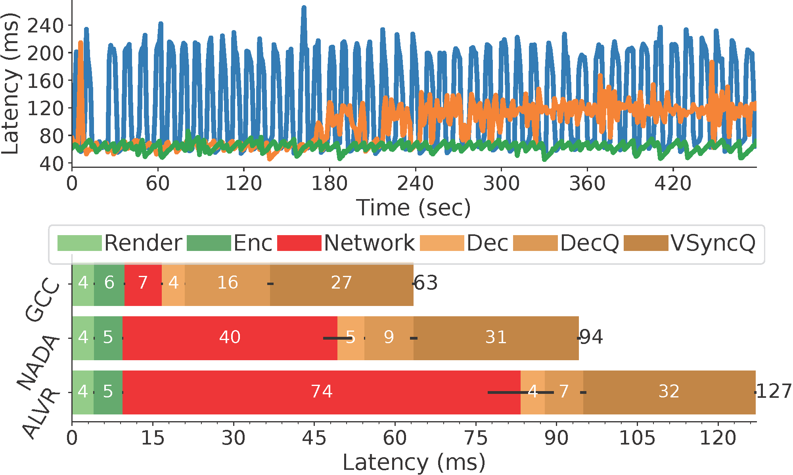
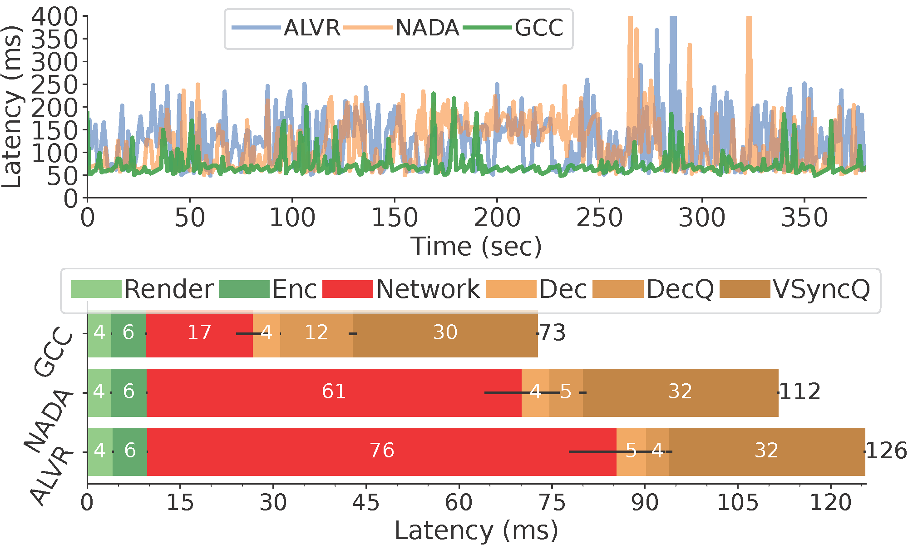
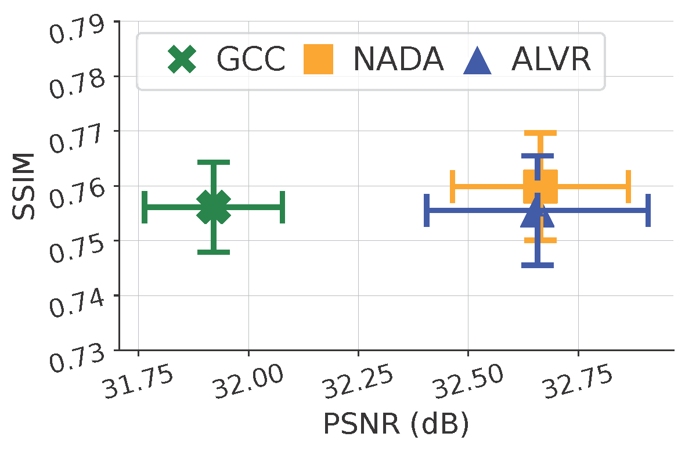

[Congestion Control for VR Cloud Gaming: Integration and Comparison in Real VR Gaming Environment](https://dl.acm.org/doi/abs/10.1145/3746027.3755439)    
To be published in the Proceedings of the 33rd ACM International Conference on Multimedia 2025 (ACM MM'25)   
The system is built upon the [codebase of ALVR](https://github.com/alvr-org/ALVR).  
We are grateful to the ALVR team for their work, and we acknowledge and give them credit for their contributions. 
ALVR streams VR games from your PC to your VR headset via Wi-Fi.  
Please read more details about the supported VR Headsets, PC OS, requirements, and tools required on [ALVR](https://github.com/alvr-org/ALVR).

## Build from source
We created 3 main branches: 1) the default branch (GCC) implements the Google Congestion Control algorithm based on its [RFC](https://datatracker.ietf.org/doc/html/draft-ietf-rmcat-gcc-02) and the [webrtc opensource](https://webrtc.googlesource.com/src/) , 2) the NADA branch implements the Cisco standard (NADA: A Unified Congestion Control Scheme for Real-Time Media) according to its [RFC](https://datatracker.ietf.org/doc/draft-ietf-rmcat-nada/02/), and 3) ALVR-origin implements the default ALVR bitrate control. Note that you need to change the ALVR bitrate to adaptive (ABR) before testing on ALVR-origin.

Once cloned, you can checkout any branch and follow the guide [here](https://github.com/alvr-org/ALVR/wiki/Building-From-Source) to build the server and client applications from source.

## System Architecture

We integrated GCC and NADA for adaptive game streaming and evaluated them against ALVR adaptive bitrate (ABR mode). This integration not only enables fair performance evaluation across benchmarks but also ensures game-agnostic VR cloud gaming through interoperation with SteamVR. 

The **Network Statistics** module feeds network performance metrics to the **Congestion Control** module to compute the target bitrate according to the network conditions. This module outputs the target bitrate and passes it to the **Video Encoder** module.
## System Performance 
### Bitrate to network throughput
|  |  |
|-------------------------------------------------------------------------|----------------------------------------------------------------------------------------------------------------|
| *Stable WiFi Network* | *5G Mobile Network* |

### Motion-to-photon Latency 
|  |  |
|------------------------------------------------------------------------------------|------------------------------------------------------------------------|
| *Stable WiFi Network* | *5G Mobile Network* |

### Visual Quality (PSNR and SSIM)
|  |  |
|--------------------------------------------------------------------------------------------------------------------------|------------------------------------------------------------------------------------------------------------------------|
| *Stable WiFi Network* | *5G Mobile Network* |
